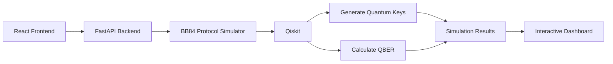

<div align="center">

# 🛡️ Quantum Security Toolkit

### Interactive BB84 Quantum Key Distribution Simulator

Build, visualize, and analyze secure quantum communication using the **BB84 Quantum Key Distribution (QKD) Protocol** with **React**, **FastAPI**, and **Qiskit**.


</div>

---

# 📖 Overview

Quantum Key Distribution (QKD) leverages the principles of quantum mechanics to enable secure communication. Unlike classical cryptography, BB84 can detect the presence of an eavesdropper by measuring the **Quantum Bit Error Rate (QBER)**.

This project provides an interactive implementation of the **BB84 protocol**, combining a modern web interface with a FastAPI backend and Qiskit-based simulation to demonstrate how quantum-secure key exchange works.

---

# ✨ Features

- ⚛️ BB84 Quantum Key Distribution simulation
- 🔐 Secure quantum key generation
- 📊 Real-time Quantum Bit Error Rate (QBER) analysis
- 👥 Alice and Bob key comparison
- 🚨 Eavesdropping detection
- 📈 Interactive analytics dashboard
- 📉 Simulation history visualization
- 💎 Modern glassmorphism UI
- 📱 Fully responsive design
- ⚡ FastAPI REST API
- 🧪 Qiskit-powered quantum simulation

---

# 🏗️ System Architecture



---

# ⚛️ BB84 Protocol Flow

```text
Alice
   │
   ▼
Generate Random Bits
   │
Choose Random Bases
   │
Encode Photons
   │
════════ Quantum Channel ════════
          (Potential Eve)
   │
   ▼
Bob Measures Photons
   │
Compare Measurement Bases
   │
Discard Mismatched Bases
   │
Calculate QBER
   │
Generate Shared Secret Key
```

---

# 📊 Dashboard Modules

### 🏠 Hero

- Launch BB84 simulation
- Responsive design
- Loading state
- Quantum-themed interface

### 📈 Metrics

Displays:

- Quantum Bit Error Rate (QBER)
- Match Rate
- Errors
- Key Length
- Security Status

### 🔑 Key Comparison

Displays generated keys for:

- Alice
- Bob

to verify successful key distribution.

### 🔄 Protocol Flow

Visual representation of the complete BB84 communication process, including optional eavesdropping.

### 📊 Analytics

- QBER trends
- Match rate history
- Error distribution
- Simulation statistics

---

# 🛠️ Tech Stack

## Frontend

- React
- Vite
- CSS3
- React Icons
- Recharts

## Backend

- Python
- FastAPI
- Qiskit
- Uvicorn
- NumPy

---

# 📂 Project Structure

```text
Quantum-Security-Toolkit
│
├── api/
│   ├── __init__.py
│   └── server.py
│
├── core/
│   ├── bb84.py
│   ├── attacks.py
│   ├── crypto.py
│   ├── security.py
│   └── models.py
│
├── tests/
│
├── quantum-security-ui/
│   ├── public/
│   ├── src/
│   ├── package.json
│   └── vite.config.js
│
├── app.py
├── requirements.txt
├── README.md
└── LICENSE
```

---

# 🚀 Getting Started

## Clone Repository

```bash
git clone https://github.com/yashas396/Quantum-Security-Toolkit.git

cd Quantum-Security-Toolkit
```

---

## Backend Setup

```bash
pip install -r requirements.txt

uvicorn api.server:app --reload
```

Backend runs at:

```text
http://127.0.0.1:8000
```

---

## Frontend Setup

```bash
cd quantum-security-ui

npm install

npm run dev
```

Frontend runs at:

```text
http://localhost:5173
```

---

# 📡 API Endpoint

## Run BB84 Simulation

```
GET /simulate
```

### Example Response

```json
{
  "qber": 0.03,
  "errors": 4,
  "key_length": 128,
  "match_rate": 97,
  "status": "SECURE",
  "alice_key": "10100110...",
  "bob_key": "10100110..."
}
```

---

# 🎯 Learning Outcomes

This project demonstrates practical implementation of:

- Quantum Key Distribution (QKD)
- BB84 Protocol
- Quantum Communication Fundamentals
- FastAPI Backend Development
- REST API Design
- React Dashboard Development
- Data Visualization
- Responsive Web Design
- Frontend–Backend Integration

---

# 🔮 Future Enhancements

- IBM Quantum Hardware execution
- Noise model simulation
- Multiple communication participants
- Export simulation reports
- User authentication
- Quantum circuit visualization
- Advanced attack simulations
- Deployment with Docker

---

# 👩‍💻 Author

**Yashaswini**

- GitHub: https://github.com/yashas396

If you found this project useful, consider giving it a ⭐ on GitHub.

---

# 📄 License

This project is licensed under the MIT License. See the **LICENSE** file for more information.

---

<div align="center">

### ⭐ Thanks for visiting!

Exploring quantum computing through practical applications is the best way to learn. Contributions, suggestions, and feedback are always welcome.

</div>